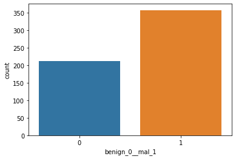

![Breast-Cancer-Wisconsin-Diagnostic-Data-Analysis-Using-Tensorflow]

It is a Python3 project to classify cancer data using
Google's TensorFlow library and Neural Networks. The goal of this
project was to validate and demonstrate that modern machine learning
techniques in neural nets could prove to be useful in classifying
cancer datasets.

## Built With

- [Python3](https://www.python.org/downloads/)
  [(Anaconda)](https://www.continuum.io/downloads)
- [NumPy](http://www.numpy.org/)
- [Pandas](http://pandas.pydata.org/)
- [TensorFlow](https://www.tensorflow.org)

(img/correlation.png)
(img/heatmap.png)
(img/loss.png)
(img/tensorboard_PCA.png)

![Author]

- **Mohd Aquib**

- [UCI's Breast Cancer Wisconsin Data Set](<https://archive.ics.uci.edu/ml/datasets/Breast+Cancer+Wisconsin+(Diagnostic)>)
